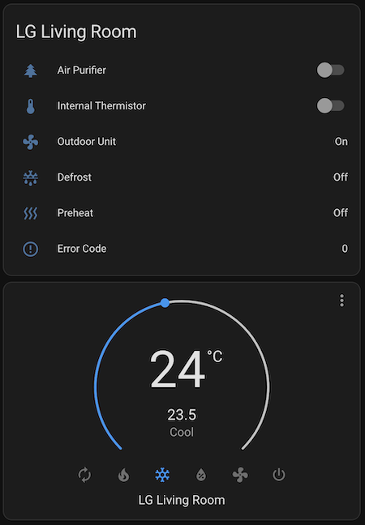

# ESPHome LG AC Wired Controller

ESPHome component implementing a custom wall controller for LG Air Conditioners. This allows basic control of an indoor unit from Home Assistant. It also optionally replaces the use of the unit's internal thermistor with a Home Assistant temperature sensor.

This has some advantages compared to the [LG ThinQ integration](https://github.com/ollo69/ha-smartthinq-sensors) for Home Assistant:
* Ability to use an external sensor for room temperature.
* Does not depend on LG's ThinQ cloud service.
* No annoying sounds from the AC unit when changing settings through the controller.
* More settings and information available, although some settings like display light on/off are available in ThinQ but aren't passed to the controller as far as I can tell.

 

# Protocol and Compatibility
There seem to be two different protocols that LG AC units and wall controllers use to communicate: 
1. A 6-byte protocol where the controller sends a 6-byte message every N seconds and the AC unit responds with a 6-byte message. This is the more basic protocol and likely older because it doesn't support advanced features and settings. An ESPHome implementation of this is available here: https://github.com/Flameeyes/esphome-lg-pqrcuds0
2. A 13-byte [protocol](protocol.md) where the controller sends a 13-byte status message every 20 seconds (or when there's a change in settings) and the AC unit sends a very similar status message every 60 seconds. There are also other message types for more advanced settings. **This is the one implemented here.**

The controller hardware is identical because both use a very slow serial connection (104 bps) over a three-wire cable (Red = 12V, Yellow = Signal, Black = GND). In fact, some LG controllers support both protocols: my LG PREMTB001 controller first tries the 13-byte protocol and if it doesn't receive a response it will switch to the 6-byte protocol.

This component should be compatible with LG AC units like the PC12SQ, AP12RT etc. I've only tested this with units connected to a multi-split outdoor unit, but single-split will very likely also work.

This controller is written to be the main/only wired controller connected to the AC. LG calls this the "master" controller. I haven't tested connecting a second controller in slave mode.

The LG ThinQ app and (IR) remote control still work. The AC unit will synchronize settings with the wall controller.

See [protocol.md](protocol.md) for notes on the protocol based on reverse engineering behavior of the PREMTB001 controller.

# Hardware
See [hardware/](hardware/) for schematics. This part was based on the excellent work and research by [@Flameeyes](https://github.com/Flameeyes):
* https://flameeyes.blog/tag/lg/
* https://github.com/Flameeyes/esphome-lg-pqrcuds0

The hardware needs three main components:
1) **Microcontroller**. Similar to their setup, I used an Espressif ESP32-DevKitC-32E board (it has the ESP32-WROOM-32E module).
A devkit module is nice for this because it doesn't need any external components. My PCB has two female pin headers connecting it to the board. This also makes it easy to replace or upgrade if needed.
2) **Transceiver**. The AC has a single (12V) signal wire but the microcontroller has separate (lower-voltage) RX/TX pins. I used a [TI TLIN1027DRQ1](https://www.ti.com/product/TLIN1027-Q1/part-details/TLIN1027DRQ1) LIN bus transceiver. LIN bus transceivers are typically used in the automotive industry but work well for this too. As [explained](https://flameeyes.blog/2021/06/29/lg-aircon-reversing-part-2-buses-and-cars/) by Flameeyes, it's important to use a LIN bus transceiver without the "TXD-Dominant Timeout" feature because LG's very slow ~104 bps serial connection can trigger that timeout and this will corrupt the signal.
3) **Voltage regulator**. The AC supplies 12V but the microcontroller needs 3.3V. I replaced the voltage regulator part with a [Traco Power TSRN 1-2433](https://www.tracopower.com/int/model/tsrn-1-2433) step-down switching regulator because it doesn't require any external components such as capacitors or inductors.

The only other components on my PCB are a screw terminal for connecting the PCB to the AC and some capacitors, resistors and diodes that are based on the TLIN1027DRQ1 data sheet. I used SMT components if available because I had the PCBs assembled by PCBWay. 

Note: an alternative for the LIN bus transceiver is the opto-isolator design used here:
* https://github.com/AussieMakerGeek/LG_Aircon_MQTT_interface
* https://www.instructables.com/Hacking-an-LG-Ducted-Split-for-Home-Automation/

# Software
There are multiple ways to build the firmware, flash it on the device, and add the controller in Home Assistant. I used the following steps:
1. Clone this repository and navigate to the `esphome` directory.
2. Install ESPHome command line tools on Linux: https://esphome.io/guides/installing_esphome.html
3. Ensure the Python virtual environment is activated (`source venv/bin/activate`).
4. Copy `template.yaml` to (for example) `lg-livingroom.yaml` and edit the lines marked with `XXX`.
5. Connect the ESP32 module to your computer with a micro USB cable. This is only needed the first time, after that it can use OTA updates over wifi.
6. Run `esphome run lg-livingroom.yaml` to build the firmware and upload it to the device.
7. The device can now be added in Home Assistant (Settings => Devices & Services). HA will ask you for the encryption key from the YAML file.
 
If you just want to connect to the device to view the debug logs, use `esphome logs lg-livingroom.yaml`.

# License
This project is licensed under the 0BSD License. See the LICENSE file for details.
This basically means you can use it however you want. Attribution is not required but would be greatly appreciated.
