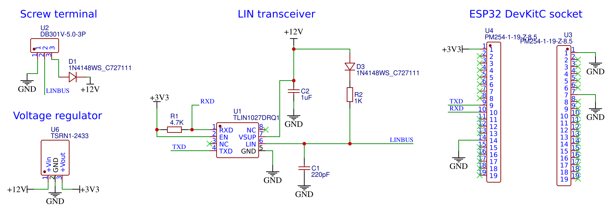

# ESPHome LG AC Wired Controller
Wired controller for LG Air Conditioners using an ESP32 microcontroller and [ESPHome](https://esphome.io/). It can be used to control an indoor unit from [Home Assistant](https://www.home-assistant.io/).

This has some advantages compared to the [LG ThinQ integration](https://github.com/ollo69/ha-smartthinq-sensors):
* Can override the unit's room temperature thermistor with a Home Assistant temperature sensor.
* Does not depend on LG's ThinQ cloud service.
* Supports units without a Wifi module.
* No annoying sounds from the AC unit when changing settings through the controller.
* More settings and information available (although some settings like display light on/off are available in ThinQ but aren't passed to the wired controller).

# Compatibility
### Supported AC units
If your indoor unit supports the LG PREMTB100 and/or LG PREMTA200 controller, it will very likely be compatible.

The [wiki](https://github.com/JanM321/esphome-lg-controller/wiki) has a list of LG AC units that have been tested with this controller.

### Multiple controllers
It's possible to connect multiple controllers to a single indoor unit, but one of them must be set as 'master' and the others as 'slave'. Since February 2024, this ESPHome controller has experimental support for this. I'm not using this myself, so there might be some issues with this (please report them).

The room temperature sensor is ignored for 'slave' controllers, so if you want to use this controller with an LG controller and use a Home Assistant temperature sensor, the LG controller must be set as 'slave'.

### Details
There seem to be two different protocols that LG AC units and wall controllers use to communicate: 
1. **6-byte protocol**: the controller sends a 6-byte message every four seconds or so and the AC unit responds with a 6-byte message. This is the more basic protocol and likely older because it doesn't support advanced features and settings. An ESPHome implementation of this is available here: https://github.com/Flameeyes/esphome-lg-pqrcuds0
2. **13-byte [protocol](protocol.md)**: the controller sends a 13-byte status message every 20 seconds (or when there's a change in settings) and the AC unit sends a very similar status message every 60 seconds. There are also other message types for more advanced settings. **This is the one implemented here.**

The controller hardware is identical because both use a very slow serial connection (104 bps) over a three-wire cable (Red = 12V, Yellow = Signal, Black = GND). In fact, some LG controllers support both protocols: my LG PREMTB001 controller first tries the 13-byte protocol and if it doesn't receive a response it will switch to the 6-byte protocol. My LG PREMTB100 (newer controller) only supports the 13-byte protocol as far as I can tell.

Wired controllers must be connected to the CN-REMO socket on the indoor unit's PCB (green 3 pin JST-XH connector). Fortunately my wall units came with a short extension cable already plugged into that port so I only had to open up the bottom part of the unit to connect my controller.

Wired controllers using the new protocol only send and receive settings and current temperature. The HVAC unit itself decides when to start/stop active cooling/heating etc based on this. It's possible to use a Home Assistant template sensor as temperature sensor to influence this behavior (see below).

See [protocol.md](protocol.md) for information about the protocol based on reverse engineering the PREMTB001 and PREMTB100 controllers.

# Hardware
There are three different PCB designs. The "hardware-tiny" variant is most popular at this point. The "hardware-FeatherS3" PCB is a more recent addition.

## "hardware" (original, June 2023)

You need at least the following parts for each indoor unit:
* PCB. See the original PCB in the [hardware/](hardware/) directory
* ESP32 DevKitC board. I used an Espressif ESP32-DevKitC-32E.
* Cable with JST-XH connector to connect the PCB to the AC. I used an Adafruit 4873 cable.

The `hardware/` PCB I ordered from [PCBWay](https://www.pcbway.com/QuickOrderOnline.aspx).

## "hardware-tiny" (November 2023)

You need at least the following parts for each indoor unit:
* PCB. See the cheaper and smaller PCB in the [hardware-tiny/](hardware-tiny/) directory.
* ESP32 DevKitC board. I used an Espressif ESP32-DevKitC-32E.
* Cable with JST-XH connector to connect the PCB to the AC. I used an Adafruit 4873 cable.

The `hardware-tiny/` PCB can be ordered from [JLCPCB](https://cart.jlcpcb.com/quote/) (see instructions [here](https://github.com/JanM321/esphome-lg-controller/issues/2#issuecomment-1801803656)).

## "hardware-FeatherS3" (May 2025)

You need at least the following parts for each indoor unit:
* PCB. See the even smaller PCB in the [hardware-FeatherS3/](hardware-FeatherS3/) directory.
* Unexpected Maker's [ESP32 FeatherS3](https://esp32s3.com/feathers3.html)
* Cable with JST-XH connector to connect the PCB to the AC. I used an Adafruit 4873 cable.

This PCB supports the more modern [FeatherS3 by Unexpected Maker](https://esp32s3.com/feathers3.html), which has a USB-C connector. The FeatherS3 [can be powered from the 3.3V pin](https://help.unexpectedmaker.com/index.php/knowledge-base/can-i-power-my-board-from-the-3v3-pin/), which is what is assumed here. The USB-C connector should not be connected at the same time; if you want to power the FeatherS3 via USB, you should not connect the 3.3V pin.

The `hardware-FeatherS3/` PCB can be ordered from [JLCPCB](https://cart.jlcpcb.com/quote/).

JLCPCB ordering instructions:

* Upload [`GERBER-lg_hvac_esp32.zip`](hardware-FeatherS3/jlcpcb/production_files/GERBER-lg_hvac_esp32.zip) as the gerber file, leave all settings default.
* Enable the `Assembly` option at the bottom of the quote page and proceed.
* Upload [`BOM-lg_hvac_esp32.csv`](hardware-FeatherS3/jlcpcb/production_files/BOM-lg_hvac_esp32.csv) for the bom file and [`CPL-lg_hvac_esp32.csv`](hardware-FeatherS3/jlcpcb/production_files/CPL-lg_hvac_esp32.csv) for placement / cpl

I paid about $50 for five boards, fully assembled, before any shipping and import duties.

*Note: if you use the FeatherS3 PCB, you'll also need to make some changes to `esphome/base.yaml` for ESPHome as part of the next step. See the FeatherS3 comments in that file.*

# ESPHome Firmware
I used the following steps to build the ESPHome firmware, flash it on the device, and add the controller in Home Assistant:
1. Clone this repository and navigate to the `esphome` directory.
2. Install ESPHome command line tools on Linux: https://esphome.io/guides/installing_esphome.html
3. Ensure the Python virtual environment is activated (`source venv/bin/activate`).
4. Copy `template.yaml` to (for example) `lg-livingroom.yaml` and edit the lines marked with `XXX`.
5. Connect the ESP32 DevKitC board to your computer with a micro USB cable. This is only needed the first time, after that it can use OTA updates over wifi.
6. Run `esphome run lg-livingroom.yaml` to build the firmware and upload it to the device.
7. The device can now be added in Home Assistant (Settings => Devices & Services). HA will ask you for the encryption key from the YAML file.
8. Disconnect the micro USB cable.
9. Install the ESP32 DevKitC board on the PCB and connect the PCB to the AC.

If you just want to connect to the device to view the debug logs, use `esphome logs lg-livingroom.yaml`.

# Features
Features currently available in Home Assistant:
* Operation mode (off, auto, cool, heat, dry/dehumidify, fan only).
* Target temperature (0.5°C steps).
* Use of a Home Assistant temperature sensor for room temperature (rounded to nearest 0.5°C). 
* Fan speed (slow, low, medium, high, auto).
* Swing mode (off, vertical, horizontal, both).
* Airflow up/down setting from 0-6 for up to 4 vanes (vane angle, with 0 being default for operation mode).
* Switch for external vs internal thermistor.
* Switch for air purifier (plasma) on/off.
* Switch and binary sensor for Auto Dry (also known as Auto Clean) feature. Used to dry indoor unit when it's turned off after cooling/dehumidifying.
* Sensors for reporting outdoor unit on/off, defrost, preheat, error code.
* Sensors for reporting in/mid/out pipe temperatures (if supported by unit).
* Input field for sleep timer from 0 to 420 minutes (0 turns off the sleep timer).
* Input fields for fan speed installer setting (to fine-tune fan speeds, 0-255 with 0 being factory default). This is installer setting 3 (ESP Setting) on LG controllers.
* Select option for over heating installer setting from 0-4 (to change over heating behavior in heating mode). This is installer setting 15 (Over Heating) on LG controllers.
* YAML options for Fahrenheit mode and 'slave' controller mode.
* Detects & exposes only supported capabilities for the connected indoor unit.

The LG ThinQ app and wireless remote can still be used to change these settings and other settings. They'll be synchronized with this controller.

Unfortunately not all settings are exposed to the wired controller, but if you're interested in a feature and it's supported by the PREMTB100 or PREMTA200 controller, please open an issue and we can consider adding it.

# Tips
* [Issue #43](https://github.com/JanM321/esphome-lg-controller/issues/43) has some information on temperature sensors that work well for this.
* It's possible to use a Home Assistant template sensor as room temperature sensor. I'm [using this](https://gist.github.com/JanM321/b550285713f20231386509b2c227f0b8) to work around some issues with my LG Multi F unit in heating mode.

# PCB (details)
***❗ Update November 2023: This section is for my original PCB in the hardware/ directory. [Florian Brede](https://github.com/florianbrede-ayet) has designed a smaller and cheaper PCB that can be ordered from JLCPCB. It's in the [hardware-tiny/](hardware-tiny/) directory.***

See [hardware/](hardware/) for schematic and list of materials. This part was based on the excellent work and research by [@Flameeyes](https://github.com/Flameeyes):
* https://flameeyes.blog/tag/lg/
* https://github.com/Flameeyes/esphome-lg-pqrcuds0

The hardware needs four main components:
1) **Microcontroller**. Similar to their setup, I used an Espressif ESP32-DevKitC-32E board (it has the ESP32-WROOM-32E module).
A devkit module is nice for this because it doesn't need any external components. My PCB has two female pin headers connecting it to the board. This also makes it easy to replace or upgrade if needed.
2) **Transceiver**. This is needed because the AC has a single (12V) signal wire but the microcontroller has separate (lower-voltage) RX/TX pins. I used a [TI TLIN1027DRQ1](https://www.ti.com/product/TLIN1027-Q1/part-details/TLIN1027DRQ1) LIN transceiver. LIN transceivers are typically used in the automotive industry but work well for this too. As [explained](https://flameeyes.blog/2021/06/29/lg-aircon-reversing-part-2-buses-and-cars/) by Flameeyes, it's important to use a LIN transceiver without the "TXD-Dominant Timeout" feature because LG's very slow ~104 bps serial connection can trigger that timeout and this will corrupt the signal.
3) **Voltage regulator**. This is needed because the AC supplies 12V but the microcontroller requires 3.3V. I replaced the voltage regulator part with a [Traco Power TSRN 1-2433](https://www.tracopower.com/int/model/tsrn-1-2433) step-down switching regulator because it doesn't require any external components such as capacitors or inductors. (In hindsight, the [Traco Power TSR 1-2433](https://www.tracopower.com/int/model/tsr-1-2433) might have been better because it's cheaper and has better availability.)
4) **Connector**. To connect the PCB to the AC. I used a screw terminal for this.

My PCB also has some capacitors, resistors and diodes that are based on the TLIN1027DRQ1 data sheet. I'm not sure if these are really necessary but I included them to be safe and it works well. I used SMT components if available because I had the PCBs assembled by [PCBWay](https://www.pcbway.com/). **Update november 2023: the hardware-tiny/ PCB can be ordered from JLCPCB.**

Note: an alternative for the LIN transceiver is the opto-isolator design used here:
* https://github.com/AussieMakerGeek/LG_Aircon_MQTT_interface
* https://www.instructables.com/Hacking-an-LG-Ducted-Split-for-Home-Automation/

# License
This project is licensed under the 0BSD License. See the LICENSE file for details.
This basically means you can use it however you want. Attribution is not required but would be greatly appreciated.
